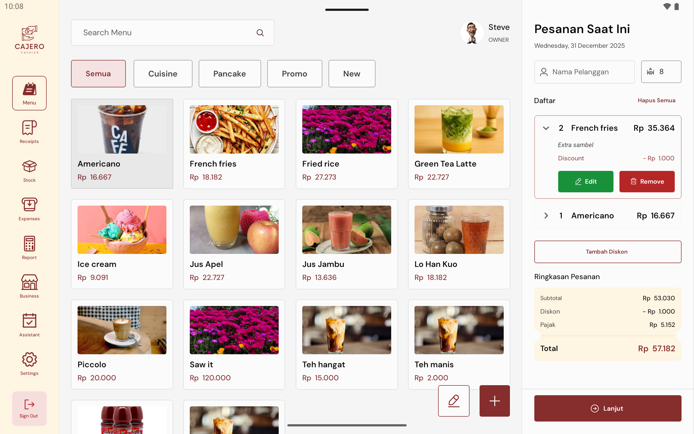
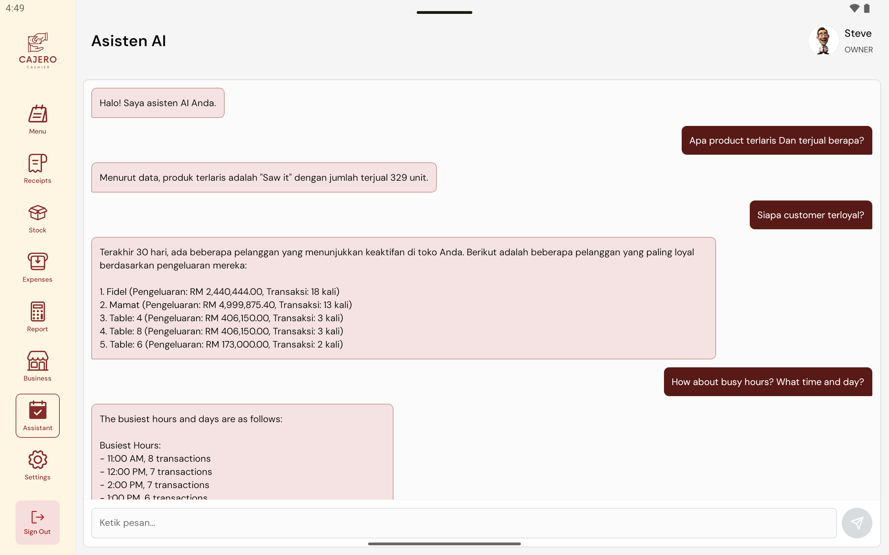

# 🤖 Cajero AI POS Ecosystem

> **A comprehensive Point of Sale ecosystem powered by Artificial Intelligence.**


**Cajero AI POS** is a modern, full-stack solution designed to streamline retail operations. It combines a robust backend, a powerful web administration dashboard, and a sleek mobile POS terminal—all integrated with Generative AI for real-time business insights.

---

## 🏗️ Project Structure

This monorepo houses the entire ecosystem:

| Directory | Component | Description | Tech Stack |
| :--- | :--- | :--- | :--- |
| **`/backend`** | **Core API** | Central hub for logic, data, and AI processing. | Java 17, Spring Boot, PostgreSQL |
| **`/frontend`** | **Admin Panel** | Web portal for store management and analytics. | React (Vite), Tailwind, Shadcn/UI |
| **`/mobile`** | **POS Terminal** | Mobile application for cashiers and sales. | React Native (Expo), TypeScript |

---

## ✨ Key Features

### 🧠 AI-Powered Insights
- **Smart Assistant**: Integrated AI Chat (Groq/Llama) for natural language queries.
- **Real-time Analytics**: Instant answers to *"What are my top selling items?"* or *"Analyze my sales trend."*

### 🛍️ Mobile POS (`/mobile`)
- **Fast Checkout**: Optimized order flow for high-volume environments.
- **Dynamic Discounts**: Secure discount engine with supervisor limits.
- **Offline Ready**: Built with local-first architecture in mind.

### 🖥️ Web Management (`/frontend`)
- **Inventory Control**: Master product catalog and recipe management.
- **Staff Management**: Role-based access control (RBAC) configuration.
- **Reporting**: Detailed charts and financial reports.

---

## 🛠️ Technology Stack

### Backend
*   **Framework**: Spring Boot 3 (Web, Data JPA, Security)
*   **Database**: PostgreSQL 16
*   **AI**: Spring AI / Custom LLM Connectors
*   **Containerization**: Docker & Docker Compose

### Web Dashboard
*   **Framework**: React 19 + Vite
*   **Styling**: Tailwind CSS + Radix UI
*   **State**: Zustand + TanStack Query

### Mobile App
*   **Framework**: React Native (Expo)
*   **Styling**: Unistyles
*   **Local DB**: SQLite (MMKV)

---

## 🚀 Getting Started

### Prerequisites
*   Docker & Docker Compose
*   Node.js 20+
*   Java 17+ (optional, for native backend dev)

### 1. Start the Backend & Database
The easiest way to stand up the core services is via Docker.

```bash
# From root directory
docker-compose up --build -d
```
*   **API**: `http://localhost:8080/api`
*   **Swagger Docs**: `http://localhost:8080/swagger-ui.html`

### 2. Run the Web Dashboard
Typically used by store managers.

```bash
cd frontend
yarn install
yarn dev
```
*   Access at: `http://localhost:5173` (default)

### 3. Run the Mobile POS
Used by cashiers on tablets/phones.

```bash
cd mobile
yarn install
yarn start
```
*   Scan the QR code with your Expo Go app (Android/iOS).

---

## 🔐 Environment Configuration

Each service supports `.env` files for configuration.

**Backend (`/backend` env vars)**
*   `GROQ_API_KEY`: Required for AI Chat.
*   `JWT_SECRET_KEY`: Token signing key.

**Web & Mobile (`.env` file)**
*   `VITE_API_URL` / `EXPO_PUBLIC_API_URL`: Point this to your backend (e.g., `http://localhost:8080`).

---

## 📸 Gallery

| Mobile POS | AI Chat | Web Dashboard |
|:---:|:---:|:---:|
|  |  |  |

---

## 🤝 Contribution

1.  Fork the Project
2.  Create your Feature Branch
3.  Commit your Changes
4.  Push to the Branch
5.  Open a Pull Request

---

## 📄 License

This project is licensed under the MIT License - see the [LICENSE](LICENSE) file for details.

---

## 👤 Author

**Fidelis Yugita**
*   Github: [@fidelisyugita](https://github.com/fidelisyugita)
