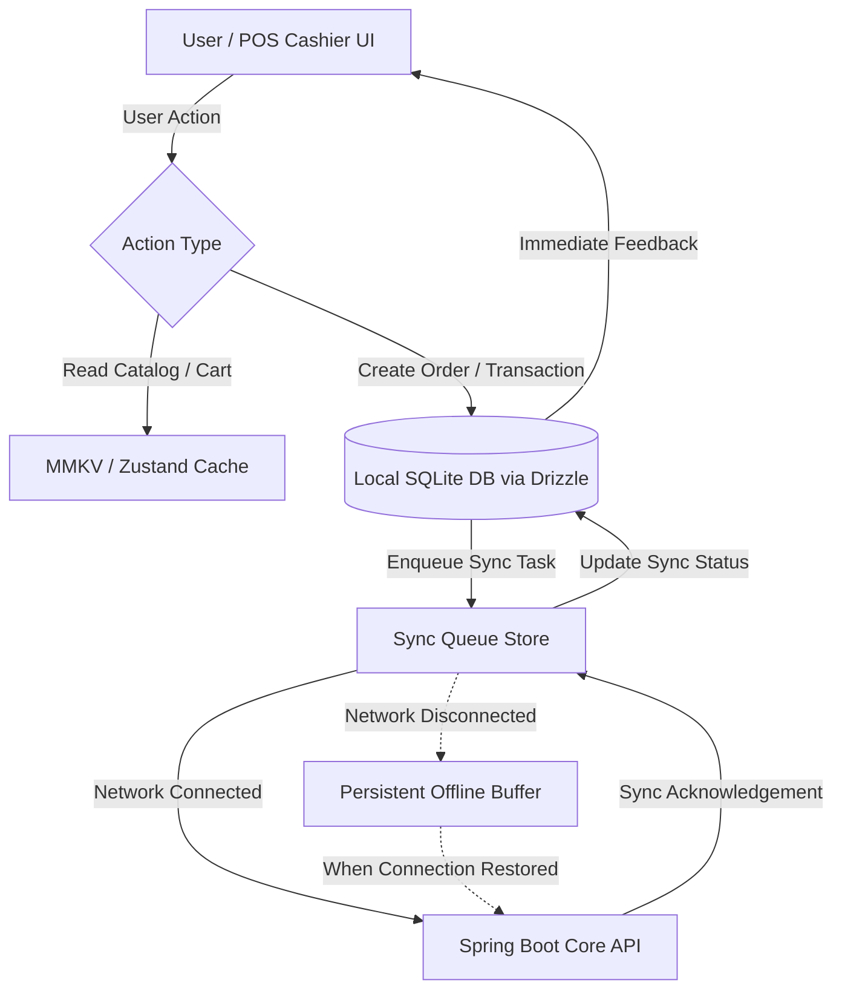
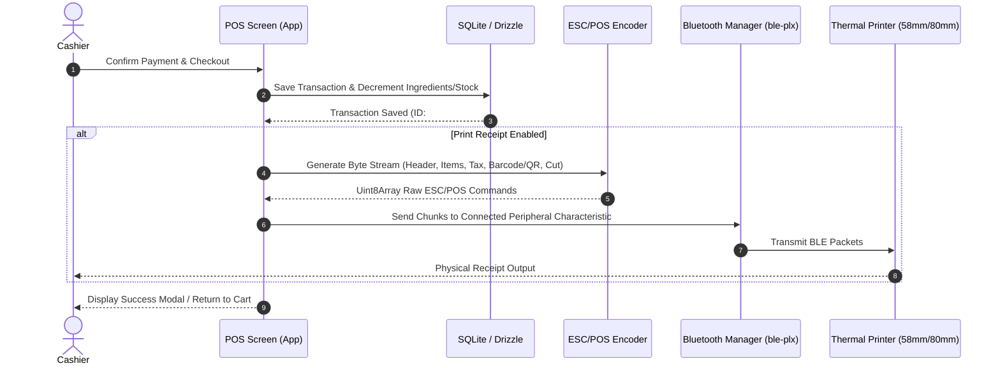

# 📱 Cajero Mobile POS

[](https://expo.dev)
[](https://reactnative.dev)
[](https://react.dev)
[](https://www.typescriptlang.org)
[](https://orm.drizzle.team)
[](https://docs.expo.dev/versions/latest/sdk/sqlite/)
[](https://github.com/jpudysz/react-native-unistyles)
[](https://biomejs.dev)
[](https://jestjs.io)
[](https://maestro.mobile.dev)

> **Cajero Mobile POS** is a modern, landscape-first Point of Sale (POS) client built with **React Native (New Architecture)** and **Expo**. Engineered for speed and reliability in high-volume retail and dining environments, it features an **offline-first SQLite architecture with Drizzle ORM**, **Bluetooth ESC/POS thermal printing**, and **instant local state persistence**.

---

## 📑 Table of Contents

- [Core Features](#-core-features)
- [System Architecture & Workflows](#-system-architecture--workflows)
  - [Offline-First Data Flow](#offline-first-data-flow)
  - [Checkout & ESC/POS Thermal Printing Flow](#checkout--escpos-thermal-printing-flow)
  - [State & Storage Layers](#state--storage-layers)
- [Tech Stack](#-tech-stack)
- [Getting Started](#-getting-started)
  - [Prerequisites](#prerequisites)
  - [Installation](#installation)
  - [Environment Configuration](#environment-configuration)
  - [Network & Local Backend Configuration](#network--local-backend-configuration)
- [Running the App](#-running-the-app)
- [Testing & Quality Assurance](#-testing--quality-assurance)
  - [Code Hygiene with Biome](#code-hygiene-with-biome)
  - [Unit & Integration Testing with Jest](#unit--integration-testing-with-jest)
  - [End-to-End Testing with Maestro](#end-to-end-testing-with-maestro)
- [Building for Production](#-building-for-production)
- [Project Directory Structure](#-project-directory-structure)
- [Hardware & Troubleshooting](#-hardware--troubleshooting)

---

## ✨ Core Features

| Feature | Description |
| :--- | :--- |
| **🛍️ POS Terminal & Checkout** | Fast, touch-optimized checkout with dynamic discount engine (percentage/fixed, supervisor limit checks), configurable tax/service fees, and split/multi-payment options (Cash, Card, QRIS). |
| **📶 Offline-First Engine** | Zero-latency operations backed by local SQLite via `expo-sqlite` and `drizzle-orm`. Complete sales, inventory lookups, and authentication fallback even with zero internet connectivity. |
| **🖨️ Bluetooth ESC/POS Printing** | Built-in BLE hardware discovery and ESC/POS byte-level receipt formatting supporting 58mm and 80mm paper widths (`react-native-ble-plx` & `esc-pos-encoder`). |
| **📦 Inventory & Recipe Control** | Real-time stock tracking, multi-unit conversions (e.g. kg to grams), ingredient usage calculations, and low-stock alerts. |
| **👥 Staff & Attendance** | Daily cashier attendance check-in/out, role-based access control (Owner vs. Staff/Cashier permissions), and quick PIN/credential switching. |
| **💸 Expense Management** | On-the-fly business expense tracking with receipt attachments (`expo-image-picker`) and category breakdowns. |
| **📊 Reports & Shift Summaries** | In-app sales overview, transaction breakdown, order history, and cashier shift closure reporting. |
| **🤖 AI Store Assistant** | Integrated configuration and AI prompt parameters for intelligent store analytics. |

---

## 🏗️ System Architecture & Workflows

### Offline-First Data Flow

The app operates on a **local-first** principle: all checkout and catalog operations interact with the local SQLite database first to ensure zero UI delay, while synchronization occurs seamlessly in the background.



### Checkout & ESC/POS Thermal Printing Flow



### State & Storage Layers

1. **MMKV (`react-native-mmkv`)**: High-performance, synchronous key-value storage used for persistent tokens, active staff session, selected printer UUIDs, and UI preferences.
2. **Zustand (`zustand`)**: Ultra-lightweight global reactive stores (`useOrderStore`, `useAuthStore`, `useIngredientStore`, `usePrinterStore`, `useAIStore`).
3. **Drizzle ORM + SQLite (`drizzle-orm`, `expo-sqlite`)**: Strongly-typed local relational database with auto-applied migrations (`db/migrations`).
4. **TanStack Query (`@tanstack/react-query`)**: Asynchronous server state management for REST API data fetching, caching, and mutation management.

---

## 🛠️ Tech Stack

| Category | Technology | Purpose |
| :--- | :--- | :--- |
| **Framework** | [Expo SDK 53](https://expo.dev) | Native development platform with New Architecture (`newArchEnabled: true`) |
| **Runtime** | [React Native 0.79.5](https://reactnative.dev) / [React 19](https://react.dev) | Mobile application runtime |
| **Routing** | [Expo Router v5](https://docs.expo.dev/router/introduction/) | Typed, file-based routing and modal navigation |
| **Styling** | [react-native-unistyles v3](https://github.com/jpudysz/react-native-unistyles) | Cross-platform, performant styling with custom design tokens |
| **Local Database** | [expo-sqlite v16](https://docs.expo.dev/versions/latest/sdk/sqlite/) + [Drizzle ORM](https://orm.drizzle.team) | Offline-first SQLite database and type-safe query builder |
| **State Management** | [Zustand v5](https://github.com/pmndrs/zustand) + [TanStack Query v5](https://tanstack.com/query) | Client & server state management |
| **Local Storage** | [react-native-mmkv v3](https://github.com/mrousavy/react-native-mmkv) | High-speed encrypted key-value store |
| **Hardware / BLE** | [react-native-ble-plx](https://github.com/dotintent/react-native-ble-plx) + [esc-pos-encoder](https://github.com/NielsLeenheer/EscPosEncoder) | Bluetooth Low Energy scanning and thermal receipt printing |
| **Forms & Validation** | [React Hook Form](https://react-hook-form.com) + [Zod v4](https://zod.dev) / [Drizzle-Zod](https://orm.drizzle.team/docs/zod) | Form state management and schema validation |
| **Code Tooling** | [Biome v2](https://biomejs.dev) | Fast linter and formatter |
| **Testing** | [Jest](https://jestjs.io), [RNTL](https://callstack.github.io/react-native-testing-library/), [Maestro](https://maestro.mobile.dev) | Unit, component, hook, store, and end-to-end testing |

---

## 🚀 Getting Started

### Prerequisites

Ensure your development environment meets the following requirements:

- **Node.js**: `v20.x` or higher (LTS recommended)
- **Package Manager**: [Yarn v4 (Berry)](https://yarnpkg.com) (configured via `.yarnrc.yml`)
- **JDK**: Java Development Kit 17 (required for Android builds)
- **Android Studio**: Android SDK (API 34+), Android SDK Build-Tools, Android Emulator
- **Xcode** (macOS only): For iOS development (iPad simulator recommended)
- **Maestro CLI** (optional, for E2E testing): `curl -Ls "https://get.maestro.mobile.dev" | bash`

### Installation

1. Navigate to the `mobile` workspace directory:
   ```bash
   cd mobile
   ```

2. Install dependencies using Yarn:
   ```bash
   yarn install
   ```

### Environment Configuration

Create a local `.env` file from `.env.example`:

```bash
cp .env.example .env
```

Configure your environment variables:

| Variable | Description | Example / Default |
| :--- | :--- | :--- |
| `EXPO_PUBLIC_API_URL` | Base URL for the Cajero Backend API | `http://10.0.2.2:8080/api` *(Android Emulator)* |
| `EXPO_PUBLIC_DEV_STAFF_EMAIL` | Default dev staff email for quick sign-in | `staff@cajero.local` |
| `EXPO_PUBLIC_DEV_STAFF_PASSWORD` | Default dev staff password | `password123` |
| `EXPO_PUBLIC_DEV_OWNER_EMAIL` | Default dev owner email for quick sign-in | `owner@cajero.local` |
| `EXPO_PUBLIC_DEV_OWNER_PASSWORD` | Default dev owner password | `password123` |

### Network & Local Backend Configuration

Because native mobile apps run in an isolated sandbox/emulator:

- **Android Emulator**: Use `http://10.0.2.2:8080/api` to refer to `localhost:8080` on your host machine.
- **Physical Device (via WiFi)**: Use your computer's local LAN IP (e.g., `http://192.168.1.50:8080/api`).
- Cleartext HTTP traffic is explicitly permitted in `app.json` for development (`expo-build-properties` $\rightarrow$ `usesCleartextTraffic: true`).

---

## 💻 Running the App

> [!IMPORTANT]
> **Native Dev Client Required**: Because this project uses native modules (`react-native-ble-plx`, `expo-sqlite` with New Architecture, `react-native-mmkv`), you **must** run using the Expo Dev Client / prebuild (`yarn android` or `yarn ios`), rather than standard Expo Go.

### Start Development Server
```bash
yarn start
```

### Run on Android (Emulator or Connected Device)
```bash
yarn android
```

### Run on iOS (iPad / iPhone Simulator)
```bash
yarn ios
```

### Clean & Rebuild Android
If you encounter native cache issues or update native plugins:
```bash
yarn android:clean
```

### Reset ADB Server
If the Android emulator or device loses connection:
```bash
yarn restart-adb
```

---

## 🧪 Testing & Quality Assurance

### Code Hygiene with Biome

This project uses [Biome](https://biomejs.dev) for formatting and linting.

```bash
# Check for lint issues across the project
yarn lint

# Auto-fix lint issues across the project
yarn lint:fix

# Lint test files specifically
yarn lint:test

# Auto-fix test files
yarn lint:test:fix

# Check formatting
yarn format:check

# Auto-format all files
yarn format
```

### Unit & Integration Testing with Jest

The test suite is powered by **Jest** and **React Native Testing Library** (`@testing-library/react-native`), with custom mocks for BLE, SQLite, MMKV, and Expo Router in `jest.setup.ts`.

```bash
# Run all tests
yarn test

# Run tests in watch mode
yarn test:watch

# Generate code coverage report
yarn test:coverage

# Run a specific test file
yarn test app/(dashboard)/attendance/__tests__/index.test.tsx
```

### End-to-End Testing with Maestro

Automated E2E user journey flows are defined in `.maestro/`:

```
.maestro/
├── config.yaml          # Global Maestro configuration & appId
├── .env.example         # Test credentials template
├── flows/               # Reusable subflows
│   ├── launch.yaml      # App launcher & state reset
│   ├── sign-in.yaml     # Sign-in action subflow
│   └── sign-out.yaml    # Sign-out & confirmation subflow
└── tests/               # Executable test suites
    ├── sign-in.yaml             # Complete authentication flow
    ├── sign-in-validation.yaml  # Form error validation tests
    └── sign-in-success.yaml     # Isolated success login test
```

#### Running Maestro Tests
```bash
# Run the complete sign-in test suite
yarn maestro:sign-in

# Run isolated form validation tests
yarn maestro:validation

# Run all test suites in .maestro/tests/
yarn maestro:test

# Launch Maestro Studio (interactive visual flow inspector)
yarn maestro:studio

# Run and record an MP4 video of the flow
yarn maestro:record
```

#### Custom Credentials
Create `.maestro/.env` to override default test credentials:
```bash
cp .maestro/.env.example .maestro/.env
# Edit TEST_EMAIL and TEST_PASSWORD in .maestro/.env
```


## 📦 Building for Production

### EAS CLI Local Builds (Recommended)
You can compile native Android builds locally without consuming EAS cloud credits using `eas build --local`. Ensure Android SDK, Java 17+, and Gradle environment are configured locally.

| Build Profile | Output Type | Command | Output File | Description |
| :--- | :--- | :--- | :--- | :--- |
| **Preview** | Standalone APK | `yarn build:eas:preview` | `builds/cajero-preview.apk` | Sideloadable APK for manual QA and testing on physical POS terminals |
| **Development** | Dev Client APK | `yarn build:eas:dev` | `builds/cajero-dev.apk` | Custom Expo Dev Client APK with native modules and debugging enabled |
| **Production** | Google Play Bundle (AAB) | `yarn build:eas:prod` | `builds/cajero-prod.aab` | Signed Android App Bundle for Google Play Store console upload |
| **Production APK** | Standalone Release APK | `yarn build:eas:prod:apk` | `builds/cajero-prod.apk` | Release APK compiled with production optimization |

#### EAS Credentials Management
All local build profiles in `eas.json` are configured with `credentialsSource: "local"`. By default, local builds will use local keystores / `credentials.json` or fallback to Android debug credentials for offline builds. To view or configure credentials:
```bash
yarn eas:credentials
```

---

### Direct Gradle Builds (Alternative)

#### Android APK (Release)
Assemble a standalone `.apk` directly via Gradle wrapper:
```bash
yarn build:apk
```
*Output location*: `android/app/build/outputs/apk/release/app-release.apk`

Clean and assemble:
```bash
yarn build:apk:clean
```

#### Android App Bundle (AAB)
Generate an Android App Bundle (`.aab`) directly via Gradle wrapper:
```bash
yarn bundle:android
```
*Output location*: `android/app/build/outputs/bundle/release/app-release.aab`

---

## 📂 Project Directory Structure

```text
mobile/
├── .maestro/               # Maestro E2E test flows and configurations
│   ├── flows/              # Reusable sub-flows
│   └── tests/              # E2E test scenarios (e.g. sign-in.yaml)
├── __mocks__/              # Global Jest mock implementations
├── app/                    # Expo Router file-based routes & screens
│   ├── (auth)/             # Authentication screens (Sign In, Pin Login)
│   ├── (dashboard)/        # Main POS navigation tabs (Checkout, Menu, Attendance)
│   ├── expense/            # Expense recording and receipt upload screens
│   ├── modal/              # Modal workflows (Discounts, Cart options, Profiles)
│   ├── payment/            # Checkout payment processing & QRIS display
│   ├── product/            # Product & category management screens
│   ├── receipt/            # Digital receipt & print preview screens
│   ├── report/             # Sales summary & shift closing reports
│   └── _layout.tsx         # Root application layout & context providers
├── assets/                 # App icons, splash screens, and static images
├── components/             # Reusable UI component library
│   ├── attendance/         # Attendance list and check-in components
│   ├── business/           # Business and employee management cards
│   ├── common/             # Generic buttons, inputs, dialogs, badges, cards
│   ├── discount/           # Discount selection and keypad modals
│   ├── expense/            # Expense form items and category pickers
│   ├── home/               # POS order summary and category filters
│   ├── menu/               # Menu catalog cards, lists, and skeleton loaders
│   ├── payment/            # Payment method selectors and change calculators
│   ├── product/            # Product configuration and ingredient pickers
│   ├── receipt/            # Receipt formatting and print trigger widgets
│   ├── report/             # Analytics charts and financial metric cards
│   └── settings/           # BLE printer discovery, AI config, and preferences
├── config/                 # Unistyles runtime and app initialization
├── db/                     # Local SQLite database layer
│   ├── migrations/         # Auto-generated SQL schema migrations
│   ├── drizzle.ts          # Drizzle ORM client initialization
│   ├── migrate.ts          # Database migration runner
│   ├── provider.tsx        # SQLite database context provider
│   └── schema.ts           # Drizzle database tables (orders, products, ingredients)
├── hooks/                  # Custom React hooks (hardware, dimensions, debounces)
├── lib/                    # Library wrappers and API client instances (Axios)
├── plugins/                # Custom Expo config plugins (Android signing, etc.)
├── services/               # TanStack Query services, mutations, and REST endpoints
│   ├── mutations/          # Data mutation hooks (products, orders, ingredients)
│   └── queries/            # Data fetch hooks (business, reports, attendance)
├── store/                  # Zustand stores (Cart, Auth, Printer, AI, Sync)
├── tokens/                 # Design tokens (Colors, Typography, Spacing, Radius)
├── types/                  # TypeScript types, DTOs, and interface contracts
├── utils/                  # Utility functions (currency formatters, date helpers)
├── app.json                # Expo application configuration & plugin definitions
├── biome.json              # Biome linting and formatting rules
├── drizzle.config.ts       # Drizzle Kit migration configuration
├── jest.config.js          # Jest test runner configuration
├── jest.setup.ts           # Test environment setup and native module mocks
└── package.json            # Scripts and project dependencies
```

---

## 🔌 Hardware & Troubleshooting

### Bluetooth Thermal Printer Pairing
1. Ensure the thermal printer (58mm or 80mm ESC/POS) is turned on and in Bluetooth pairing mode.
2. In the app, navigate to **Settings $\rightarrow$ Printer**.
3. Grant **Nearby Devices / Bluetooth permissions** when prompted.
4. Tap **Scan for Printers** to discover available BLE peripherals.
5. Select your printer and tap **Connect & Test Print** to verify ESC/POS communication.

### Android Permission Troubleshooting
If Bluetooth discovery fails on Android 12+:
- Ensure **Location Services** and **Bluetooth** are enabled on the device.
- Verify `BLUETOOTH_SCAN` and `BLUETOOTH_CONNECT` permissions are granted in device settings.

### Database Inspection with Drizzle Studio
To inspect the local SQLite database while running the app:
- The app includes `expo-drizzle-studio-plugin`.
- Start the app with `yarn start` and press `shift + d` in the Expo terminal to launch Drizzle Studio in your browser.

---

## 📄 License

This mobile application is part of the **Cajero AI POS** ecosystem and is licensed under the [MIT License](../LICENSE).
