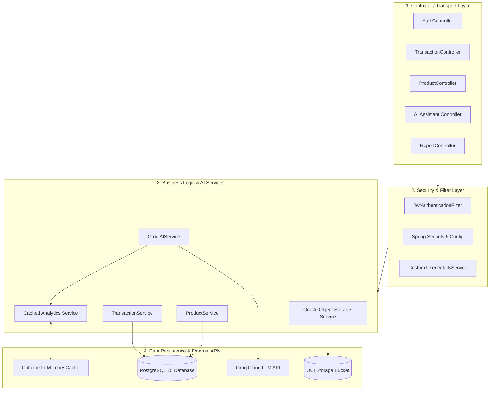
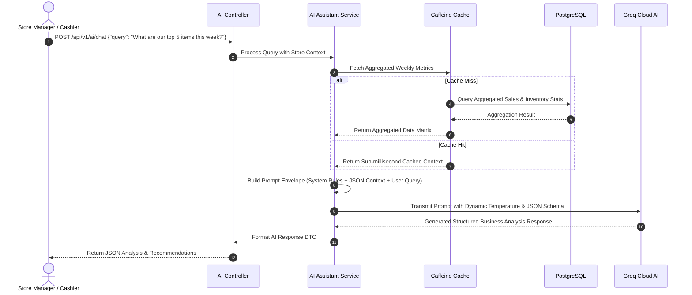

# ⚙️ Backend & AI Services

The **Cajero Core API** is a high-performance Spring Boot 3.5 application built on Java 17. It serves as the master transaction engine, authentication authority, cloud persistence layer, and AI-driven business intelligence hub for the entire Cajero ecosystem.

---

## 🏗️ Architecture & Component Design

The backend is structured around a layered domain architecture:



---

## 🧠 AI Assistant & Analytics Engine (Groq Integration)

The backend features an integrated **Generative AI Assistant** powered by Groq's low-latency inference engine utilizing `llama-3.1-8b-instant`.



### Key AI Capabilities
1. **Natural Language Analytics**: Queries like *"How did promotion X perform compared to last Tuesday?"* are automatically mapped to underlying sales aggregates.
2. **Context Compression**: High-volume transaction rows are pre-aggregated and cached in Caffeine to prevent token window overflow and reduce LLM inference latency.
3. **Guardrailed Prompts**: Strict prompt engineering prevents hallucination and confines AI answers strictly to store-owned context.

---

## 🔐 Security & JWT Authentication

### Security Workflow
1. **Login**: Client submits credentials to `POST /api/v1/auth/login`.
2. **Validation**: Spring Security authenticates username and password hash (BCrypt).
3. **Token Issuance**: Server signs and issues a stateless JSON Web Token (JWT) with user roles.
4. **Per-Request Validation**: `JwtAuthenticationFilter` intercepts requests, validates the signature, extracts the user identity, and populates the `SecurityContextHolder`.

### Role-Based Access Control (RBAC) Matrix

| Endpoint Group | Accessible Roles | Description |
| :--- | :--- | :--- |
| `/api/v1/auth/**` | Public (Permit All) | User sign-in, PIN login, token validation |
| `/api/v1/pos/**` | `ROLE_STAFF`, `ROLE_OWNER` | Order creation, stock deduction, shift logging |
| `/api/v1/products/**` | `ROLE_STAFF` (Read), `ROLE_OWNER` (Write) | Product catalog and category administration |
| `/api/v1/reports/**` | `ROLE_OWNER` | Full financial reports, profit & loss, tax summaries |
| `/api/v1/ai/**` | `ROLE_STAFF`, `ROLE_OWNER` | AI chat and store insights queries |

---

## 🗄️ Database & Cloud Storage

### PostgreSQL Relational Schema
- **Entities**:
  - `users`, `roles`, `permissions`: Staff and authentication records.
  - `products`, `categories`, `product_variants`: Master catalog with unit conversions.
  - `ingredients`, `recipes`: Bill of Materials (BOM) for dynamic inventory tracking.
  - `transactions`, `transaction_items`, `payments`: Sales, multi-payment methods, and discounts.
  - `petty_cash`, `expenses`: Business expense ledger with receipt media URLs.
  - `attendance`: Cashier shift check-in/out timestamps and cash float reconciliations.

### Oracle Cloud Infrastructure (OCI) Object Storage
- File attachments (receipt images, product photos) are streamed directly to OCI Object Storage buckets.
- Download URLs are generated with configurable expiration for secure client-side rendering.

---

## 📖 API Documentation & Swagger UI

Interactive OpenAPI 3.0 documentation is enabled by default:
- **Swagger UI**: `http://localhost:8080/swagger-ui.html`
- **OpenAPI JSON Spec**: `http://localhost:8080/v3/api-docs`

---

## 🧪 Testing & Code Quality

```bash
cd backend

# Run all unit and integration tests
./gradlew test

# Generate JaCoCo code coverage report
./gradlew jacocoTestReport
# Open report: build/reports/jacoco/test/html/index.html

# Run Checkstyle formatting verification
./gradlew checkstyleMain

# Run SpotBugs static analysis
./gradlew spotbugsMain
```
