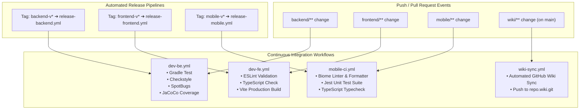

# 🚀 DevOps, CI/CD & Release Runbooks

This guide covers continuous integration workflows, release pipelines, multi-workspace semantic version tagging, mobile build targets, and automated Sentry sourcemap uploads.

---

## 🔄 CI/CD Pipelines (GitHub Actions)

The monorepo uses isolated GitHub Action workflows scoped to individual package changes:



---

## 🏷️ Monorepo Semantic Version Tagging

Releases are tracked independently per sub-workspace to allow continuous delivery without coupling deployment cycles:

| Workspace | Tag Prefix Pattern | Example Tag | Triggered Release Workflow |
| :--- | :--- | :--- | :--- |
| **Mobile App** | `mobile-v<semver>` | `mobile-v1.0.8` | `.github/workflows/release-mobile.yml` |
| **Admin Web** | `frontend-v<semver>` | `frontend-v1.0.0` | `.github/workflows/release-frontend.yml` |
| **Backend API** | `backend-v<semver>` | `backend-v1.0.0` | `.github/workflows/release-backend.yml` |

### Mobile Release Runbook
1. **Bump Version**:
   ```bash
   cd mobile
   yarn bump:patch # or bump:minor / bump:major
   ```
2. **Commit & Merge**: Create PR with conventional commit `chore(mobile): bump version to 1.0.8`, pass checks, and merge to `main`.
3. **Create & Push Tag**:
   ```bash
   cd mobile
   yarn tag:release -- --push
   # Or manually:
   # git tag -a mobile-v1.0.8 -m "Release mobile-v1.0.8"
   # git push origin mobile-v1.0.8
   ```
4. **Automated GitHub Release**:
   - Pushing the tag triggers `.github/workflows/release-mobile.yml`.
   - CI runs verification and generates release notes automatically.

---

## 📦 Mobile Compilation & Artifact Building

### 1. Local EAS CLI Builds (Recommended)
Compile native binaries on your local workstation without consuming EAS cloud credits:

| Profile | Command | Output File | Target Use Case |
| :--- | :--- | :--- | :--- |
| **Preview APK** | `yarn build:eas:preview` | `builds/cajero-preview.apk` | Sideloadable testing APK for physical POS hardware |
| **Dev Client** | `yarn build:eas:dev` | `builds/cajero-dev.apk` | Expo Dev Client APK with live debugging enabled |
| **Production AAB** | `yarn build:eas:prod` | `builds/cajero-prod.aab` | Signed App Bundle for Google Play Store upload |
| **Production APK** | `yarn build:eas:prod:apk` | `builds/cajero-prod.apk` | Release standalone APK optimized for distribution |

### 2. Direct Gradle Builds (Alternative)
```bash
cd mobile

# Compile standalone release APK
yarn build:apk
# Output: android/app/build/outputs/apk/release/app-release.apk

# Compile production Android App Bundle (AAB)
yarn bundle:android
# Output: android/app/build/outputs/bundle/release/app-release.aab
```

---

## 🗺️ Sentry Sourcemap Upload Pipeline

To maintain readable, de-minified stack traces in Sentry error reports, production release builds execute the automated sourcemap upload script:

```bash
cd mobile
node ./scripts/upload-sourcemaps.js
```

### Script Execution Logic
1. Reads `SENTRY_AUTH_TOKEN`, `SENTRY_ORG`, and `SENTRY_PROJECT` from the environment.
2. Extracts the current release version from `package.json` (`cajero-pos@<version>`).
3. Uses `@sentry/cli` to bundle and upload Metro JS bundles and source map assets to Sentry.

---

## 📚 Automated Wiki Synchronization

Whenever documentation changes in `wiki/**` land on the `main` branch, `.github/workflows/wiki-sync.yml` automatically checks out the GitHub Wiki repository (`https://github.com/<owner>/<repo>.wiki.git`), mirrors the markdown files, and commits the updates.

You can also trigger a manual sync locally:
```bash
yarn wiki:sync
```
