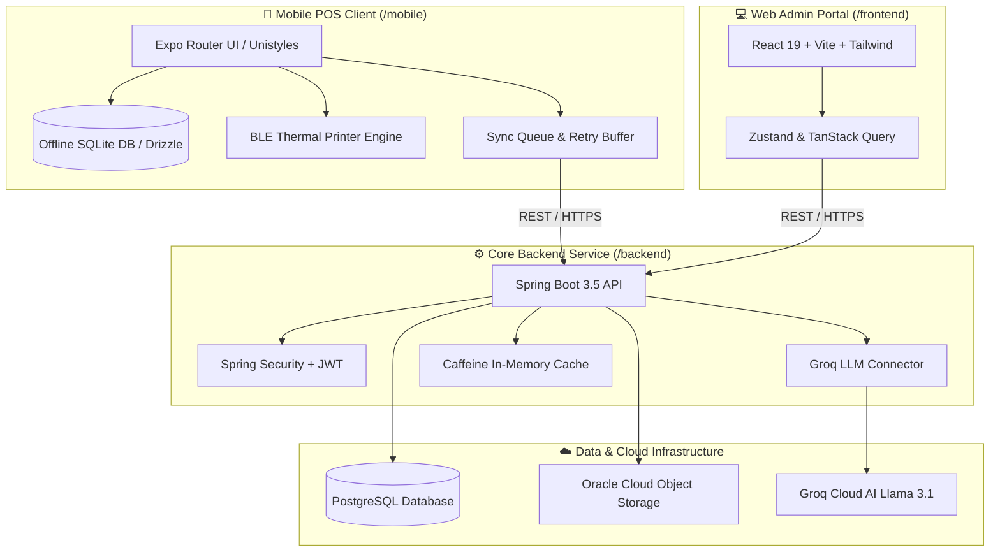

# 🤖 Welcome to the Cajero AI POS Wiki

> **Cajero AI POS** is an enterprise-ready, full-stack Point of Sale (POS) ecosystem powered by Artificial Intelligence. It combines an offline-first mobile cashier terminal, a web administration dashboard, and a robust Spring Boot microservice backend integrated with Large Language Models (LLMs) for real-time business insights.

---

## 🗺️ Ecosystem Architecture Overview

The repository is structured as a cohesive monorepo housing three core engineering sub-workspaces:

---

## 📚 Wiki Documentation Chapters

Explore the deep-dive documentation for each subsystem:

### 🏛️ Core Architecture & Setup
- **[[System-Architecture]]** — High-level topology, monorepo breakdown, cross-tier communication protocols, and technology stack matrix.
- **[[Getting-Started-&-Development]]** — Prerequisites, Docker Compose one-step setup, workspace developer commands, environment variables, and code hygiene rules.

### 📱 Subsystem Deep Dives
- **[[Mobile-POS-Terminal]]** — React Native & Expo SDK 53 New Architecture, offline Drizzle SQLite sync, BLE ESC/POS thermal printing, Unistyles design system, and Sentry telemetry.
- **[[Backend-&-AI-Services]]** — Spring Boot 3.5 REST API, Spring Security JWT authentication, Groq AI analytics integration, PostgreSQL schema, and OCI Object Storage.
- **[[Web-Admin-Portal]]** — React 19, Vite, Tailwind CSS v4, feature-sliced store management (catalog, inventory, petty cash, transactions, audit logs).

### 🚀 Operations & Troubleshooting
- **[[DevOps-&-CI-CD]]** — GitHub Actions pipelines, multi-package SemVer release tagging, standalone Android APK generation, and Sentry sourcemap uploads.
- **[[Troubleshooting-&-FAQ]]** — Android emulator networking (`10.0.2.2`), BLE printer pairing on Android 12+, Drizzle Studio database inspection, and common developer FAQs.

---

## ⚡ Quick Navigation Matrix

| Component | Directory | Primary Framework | Key Commands |
| :--- | :--- | :--- | :--- |
| **Backend** | `/backend` | Java 17 + Spring Boot 3.5 | `./gradlew bootRun` • `./gradlew test` |
| **Admin Web** | `/frontend` | React 19 + Vite + Tailwind | `yarn dev` • `yarn build` • `yarn lint` |
| **Mobile POS** | `/mobile` | Expo SDK 53 + React Native 0.79 | `yarn start` • `yarn android` • `yarn test` |
| **Ecosystem** | Root `/` | Docker Compose & Monorepo Tooling | `docker-compose up --build -d` |
