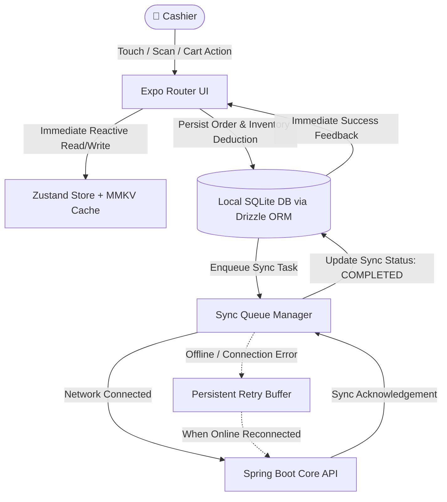
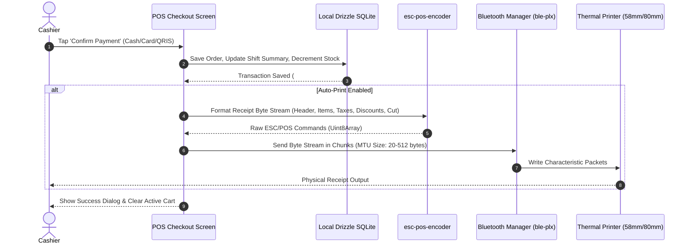
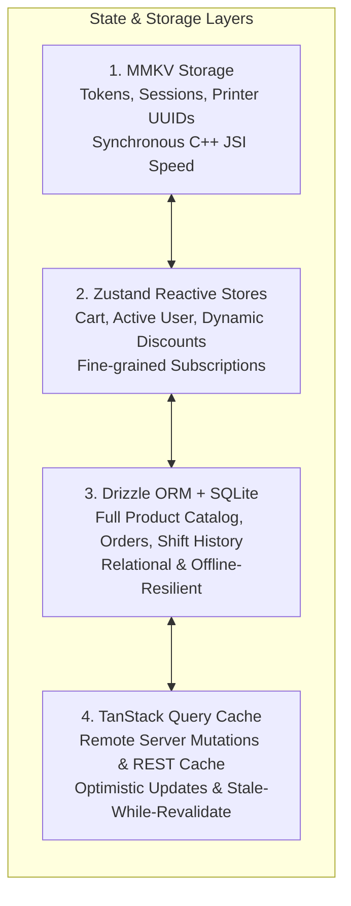

# 📱 Mobile POS Terminal

The **Cajero Mobile POS** application is a landscape-first, touch-optimized Point of Sale client built with **React Native (New Architecture)** and **Expo SDK 53**. Designed for fast-paced retail and dining environments, it guarantees zero-latency cashier operations through a local-first SQLite database and Bluetooth ESC/POS thermal printing.

---

## 🏗️ Core Architecture & Data Flows

### 1. Offline-First Architecture & Sync Queue

The mobile application operates on a **local-first principle**: all product catalog lookups, cart modifications, and transaction completions write directly to the local SQLite database first to ensure zero UI delay. Syncing with the Spring Boot backend occurs asynchronously in the background.



### 2. Checkout & ESC/POS Bluetooth Thermal Printing Flow



---

## 💾 State & Storage Hierarchy



1. **`react-native-mmkv` (v3)**: High-speed, synchronous key-value storage used for persistent authentication tokens, active cashier sessions, selected printer UUIDs, and UI preferences.
2. **`zustand` (v5)**: Reactive state management stores:
   - `useOrderStore`: Current cart items, dynamic discount calculations, tax/service fees.
   - `useAuthStore`: Active employee profile and session tokens.
   - `usePrinterStore`: Connected BLE printer device, paper width (58mm vs. 80mm), and auto-cut settings.
   - `useAIStore`: AI assistant chat sessions and prompt context.
3. **`drizzle-orm` (v0.44.4) + `expo-sqlite` (v16)**: Strongly-typed relational database with schema auto-migrations in `db/migrations/`.
4. **`@tanstack/react-query` (v5)**: Server state management for remote catalog synchronization and analytics queries.

---

## 🎨 Design System & Theming (`react-native-unistyles`)

The application uses `react-native-unistyles` v3 for performant, stylesheet-based styling with strict adherence to design tokens:

### Responsive Scaling Helpers
All spacing, typography, and layout dimensions must use responsive scaling helpers from `@/utils/Scale`:
- `s(value)`: Horizontal scaling (based on standard tablet width).
- `vs(value)`: Vertical scaling (based on standard tablet height).
- `ms(value, factor)`: Moderate scaling for typography and icon dimensions.

### Design Tokens
Tokens are centralized in `tokens/`:
- `theme.colors.*`: Brand primary, background, surface, text, border, status badges.
- `theme.spacing.*`: Consistent padding and margins (`xs`, `sm`, `md`, `lg`, `xl`).
- `theme.radius.*`: Standard corner rounding for touch targets.

---

## 🖨️ Hardware & Bluetooth Integration

### Supported Printers
- Any **58mm** or **80mm** ESC/POS compatible Bluetooth Low Energy thermal printer.

### Bluetooth Lifecycle Management
1. **Discovery**: `react-native-ble-plx` scans for nearby BLE devices advertising serial or printer services.
2. **Connection & MTU Negotiation**: Connects to the peripheral and discovers primary communication characteristics.
3. **Chunked Transmission**: Large receipt payloads are sliced into manageable byte chunks based on negotiated MTU sizes to prevent buffer overflow on low-cost thermal printer chipsets.

---

## 📊 Telemetry & Monitoring

- **Sentry (`@sentry/react-native`)**: Real-time crash reporting, unhandled promise rejections, and performance tracing.
- **PostHog (`posthog-react-native`)**: Product analytics, feature flag evaluation, and cashier funnel tracking.
- **Automated Sourcemap Uploads**: Run via `scripts/upload-sourcemaps.js` during release builds to ensure de-minified stack traces in Sentry.

---

## 🧪 Testing & Verification

### Unit & Component Tests (Jest & RNTL)
```bash
cd mobile
yarn test
yarn test:coverage
```

### End-to-End Testing (Maestro)
Automated flows are located in `.maestro/`:
```bash
cd mobile

# Run complete sign-in and checkout flows
yarn maestro:test

# Launch visual flow studio
yarn maestro:studio
```

---

## 🏷️ Version Bumping

Bumping updates `package.json`, `app.json`, and native Android `versionCode`:
```bash
cd mobile
yarn bump:patch   # e.g., 1.0.7 -> 1.0.8 (Bug fixes)
yarn bump:minor   # e.g., 1.0.7 -> 1.1.0 (New features)
yarn bump:major   # e.g., 1.0.7 -> 2.0.0 (Breaking changes)
```
