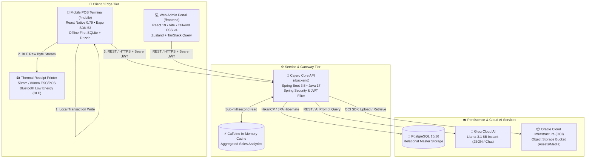

# 🏛️ System Architecture

This page outlines the end-to-end architectural topology, component boundaries, communication protocols, and technology stack powering the **Cajero AI POS** monorepo ecosystem.

---

## 🏗️ High-Level Ecosystem Topology

Cajero AI POS is composed of three decoupled core tiers operating over standard secure networking protocols and hardware communication layers:



---

## 📦 Monorepo Structure & Separation of Concerns

The repository leverages a unified monorepo model with clear domain boundaries:

```text
cajero-ai-pos/
├── backend/            # Central Spring Boot API, business domain logic, and AI connectors
├── frontend/           # React 19 web portal for store managers, inventory, and back-office reports
├── mobile/             # React Native (Expo) landscape-optimized cashier checkout application
├── docs/               # Visual assets, screenshots, and diagrams
├── scripts/            # Repository-wide maintenance and release scripts
├── wiki/               # In-repo GitHub Wiki documentation source
├── docker-compose.yml  # Multi-container local orchestration (Postgres, Backend, Admin)
└── AGENTS.md           # Engineering guidelines, package manager rules, and linting constraints
```

---

## 🔄 Cross-Tier Communication Protocols

| Protocol / Layer | Producer / Sender | Consumer / Receiver | Description & Payload Format |
| :--- | :--- | :--- | :--- |
| **REST / HTTPS** | `/mobile` & `/frontend` | `/backend` | Standard JSON payload APIs. Authentication via `Authorization: Bearer <JWT>`. Standard response envelope containing data, message, and error details. |
| **Bluetooth Low Energy (BLE)** | `/mobile` | Physical Printer | ESC/POS binary byte stream (`Uint8Array`) transmitted over BLE GATT characteristics using `react-native-ble-plx` and `esc-pos-encoder`. |
| **Local SQLite (Zero-Latency)** | `/mobile` UI | `expo-sqlite` | Local relational data queries powered by Drizzle ORM. Eliminates UI blocking during peak cashier transactions. |
| **LLM Inference** | `/backend` | Groq Cloud AI | REST API calls transmitting prompt templates with real-time business context vectors for natural language queries and transaction analysis. |
| **Object Storage** | `/backend` | Oracle Cloud Infrastructure | Multi-part uploads and presigned URL access for receipt attachments and business assets. |

---

## 🛠️ Technology Stack Matrix

### Backend Core (`/backend`)
- **Runtime & Language**: Java 17, Gradle 8.4
- **Framework**: Spring Boot 3.5.0 (Spring Web, Spring Data JPA, Spring Security, Spring Actuator)
- **Database Persistence**: PostgreSQL 15/16 with Hikari Connection Pooling
- **In-Memory Caching**: Caffeine Cache for lightning-fast business metric aggregations
- **AI Engine**: Groq API (`llama-3.1-8b-instant`)
- **Cloud Storage**: Oracle Cloud Infrastructure (OCI) Object Storage SDK
- **API Documentation**: OpenAPI 3.0 / Swagger UI (`springdoc-openapi-starter-webmvc-ui`)

### Web Admin Portal (`/frontend`)
- **Runtime & Language**: React 19.0.0, TypeScript 5.7+
- **Build Tool**: Vite 6.x
- **Styling**: Tailwind CSS v4, Lucide React icons, Radix UI primitives
- **Client & Server State**: Zustand 5 + TanStack Query v5
- **Networking**: Axios instance with centralized token refresh and interceptors
- **Forms & Validation**: React Hook Form with Zod schemas

### Mobile POS Terminal (`/mobile`)
- **Runtime & Language**: React Native 0.79.5 (New Architecture enabled), TypeScript 5.8+, React 19.0.0
- **Platform & Routing**: Expo SDK 53 with Expo Router v5 (typed file-based routing)
- **Local Persistence**: `expo-sqlite` (v16) + `drizzle-orm` (v0.44.4) + `react-native-mmkv` (v3)
- **Styling & Theming**: `react-native-unistyles` v3 + responsive scaling utilities (`s()`, `vs()`, `ms()`)
- **Hardware Integration**: `react-native-ble-plx` + `esc-pos-encoder` for Bluetooth thermal printing
- **Telemetry & Monitoring**: Sentry React Native SDK (`@sentry/react-native`) + PostHog (`posthog-react-native`)
- **Code Quality**: Biome v2 (strict formatting, linting, and cognitive complexity caps)

---

## 🛡️ Security & Authentication Model

1. **Stateful vs. Stateless**:
   - Authentication is fully stateless using **JSON Web Tokens (JWT)**.
   - Access tokens are signed using HMAC-SHA256 with a 256-bit secret key (`JWT_SECRET_KEY`).
2. **Role-Based Access Control (RBAC)**:
   - `ROLE_OWNER` / `ROLE_ADMIN`: Complete access to financial reports, inventory adjustment, staff configuration, and store-wide settings.
   - `ROLE_STAFF` / `ROLE_CASHIER`: Scoped access strictly allowing POS checkout, product lookups, shift opening/closing, and expense logging within supervisor limits.
3. **Local Token Storage**:
   - Mobile: Secured in fast, encrypted `react-native-mmkv` instances.
   - Web: Stored in memory / secure browser storage with automated token expiration handling.
